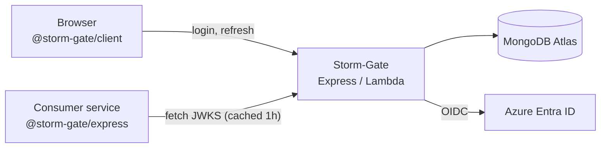

# Architecture and engineering notes

Companion to the [README](README.md). The README tells you how to use Storm-Gate; this
document explains how it works, why it is shaped this way, and where it is weak.

Written for someone auditing the token handling or picking the codebase up cold.

---

## System shape



The important property is the arrow that **is not** there: a consumer service verifying
an RS256 token never calls Storm-Gate per request. It fetches the JWKS once, caches it,
and verifies locally. Storm-Gate is not in the hot path of its consumers' authorization
checks.

Two runtimes share the same `src/`:

| Entry point | Runtime | Database module |
| --- | --- | --- |
| `src/server.js` | Long-lived Express process | `src/config/db.js` |
| `src/lambda-app.js` | Lambda via `serverless-http` | `src/config/db-lambda.js` (connection reuse across invocations) |

The split exists because a Lambda container is reused between invocations, so the Mongo
connection must be cached at module scope rather than opened per request.

---

## Route map

| Route | Guard | Notes |
| --- | --- | --- |
| `GET /health` | none | Liveness only |
| `GET /.well-known/jwks.json` | none | Public signing keys |
| `GET /.well-known/openid-configuration` | none | Discovery document |
| `POST /check-status` | none | Account status lookup |
| `/` (login, register, refresh) | none | `src/routes/auth.js` |
| `GET /me` | `auth` | Storm-Gate tokens |
| `/api/auth/admin` | `auth` + `isAdmin` | |
| `/api/user` | `verifyJWT` | |
| `/api/auth/oidc` | `enhancedVerifyJWT` | Azure AD or Storm-Gate tokens |
| `/api-docs` | none | Swagger UI |

The well-known router is mounted **before** the rate limiter in `src/server.js`, so key
discovery is not rate limited. That is defensible — consumers poll it and a throttled
JWKS breaks verification for everyone — but it is an explicit choice worth knowing.

### Three verification middlewares

This is the least tidy part of the service. Each route group uses a different verifier:

| Middleware | Accepts | How |
| --- | --- | --- |
| `auth` (`src/utils/auth.js`) | Storm-Gate tokens | Synchronous, local, HS256 **and** RS256, algorithm pinned per key |
| `verifyJWT` (`src/utils/auth.js`) | Tokens carrying a `kid` | Async, fetches a remote JWKS. Rejects HS256 Storm-Gate tokens outright, since they have no `kid` |
| `enhancedVerifyJWT` (`src/utils/enhancedAuth.js`) | Storm-Gate **or** Azure AD tokens | Async, resolves internal keys locally and Azure keys remotely, then maps the Azure subject to a local `User` |

They overlap, and `getJWKSKeys` plus `jwkToPem` are **duplicated** between `auth.js` and
`enhancedAuth.js`. Consolidating behind one verifier with a declared token-source list is
the obvious next refactor; the reason not to do it casually is that each is load-bearing
on a different route group and only `auth` and `enhancedVerifyJWT` have test coverage.

---

## Token model

| | Access token | Refresh token |
| --- | --- | --- |
| Lifetime | 1 day | 7 days |
| Algorithm | HS256 by default, RS256 when `JWT_SIGNING_ALG=RS256` | **Always** HS256 |
| Secret / key | `ACCESS_TOKEN_SECRET` or `JWT_PRIVATE_KEY` | `REFRESH_TOKEN_SECRET` |
| Verified by | Storm-Gate and any consumer | Storm-Gate only |

**Why refresh tokens stay symmetric.** Only Storm-Gate ever verifies a refresh token.
There is no third-party verifier to serve, so publishing an asymmetric key for them would
widen the change's blast radius while buying nothing. This is a deliberate asymmetry, not
an oversight — `src/utils/signingKeys.js` says so at the top.

---

## Signing keys

`src/utils/signingKeys.js` owns the whole key lifecycle. Behaviour is driven entirely by
environment variables, and the default is unchanged from the pre-RS256 service:

- **`JWT_SIGNING_ALG` defaults to `HS256`.** An existing deployment that sets nothing new
  behaves byte-for-byte as before. RS256 is opt-in.
- **`JWT_PRIVATE_KEY` accepts three encodings** — raw PEM, PEM with literal `\n` escapes,
  and base64-encoded PEM. Env plumbing mangles PEM newlines differently on each deploy
  target, so the module accepts all of them rather than making the operator guess.
- **`JWT_PUBLIC_KEY` is optional**, derived from the private key when omitted. One fewer
  thing to keep in sync.
- **`kid` is an RFC 7638 JWK thumbprint**, so it is a deterministic function of the key
  material rather than a hand-assigned label. Rotating a key necessarily changes its `kid`.

### Rotation without breaking outstanding tokens

Access tokens live a day, so a key cannot be retired the instant it stops signing.
`JWT_PREVIOUS_PUBLIC_KEYS` takes a comma-separated list of retired public keys that stay
published in the JWKS. A token signed by a retired key keeps verifying until it expires;
once the longest possible lifetime has passed, the old key can be dropped from the list.

### Publishing before switching

Setting `JWT_PRIVATE_KEY` while leaving `JWT_SIGNING_ALG` at `HS256` publishes the public
key **without** changing what gets issued. That makes the cutover a sequence of
independently reversible steps rather than one flag flip:

1. **Publish.** Set `JWT_PRIVATE_KEY`, leave `JWT_SIGNING_ALG=HS256`. The JWKS goes live;
   issuance is unchanged. Nothing can break.
2. **Upgrade consumers.** Deploy `@storm-gate/express` 0.2.0 with *both* `secret` and
   `jwksUri`. Each consumer now accepts either algorithm, so the order in which they
   deploy does not matter.
3. **Flip.** Set `JWT_SIGNING_ALG=RS256`. New tokens are RS256; the 1-day HS256 tokens
   already in circulation keep verifying because consumers still hold the secret.
4. **Drop the secret.** After the drain window, remove `secret` from consumers.

Each step is independently revertible, and no step requires simultaneous deploys.

---

## Security properties

### Algorithm confusion is rejected explicitly

This is the attack that matters when you publish a public key. Naively, a verifier that
accepts both algorithms can be handed a token whose header says `alg: HS256` and whose
signature is an HMAC computed with the *published public key* as the secret. An unpinned
verify accepts it, because the public key is not secret — anyone can compute that HMAC.

Both the service and the SDK defend against this the same way: decode the header, select
the key, then pin `algorithms` to exactly the one algorithm that key can validate.

```js
const header = jwt.decode(token, { complete: true })?.header;
let verifyKey = process.env.ACCESS_TOKEN_SECRET;
const verifyOptions = { algorithms: ['HS256'] };

if (header?.alg === 'RS256') {
  const publicKey = header.kid ? getPublicKeyByKid(header.kid) : null;
  if (!publicKey) return res.status(400).json({ msg: "unknown signing key" });
  verifyKey = publicKey;
  verifyOptions.algorithms = ['RS256'];
}
```

The pin is derived from the selected key, never from the header's own `alg` claim. An
attacker controls the header; they do not control which key it resolves to.
`test/authContract.test.js` and `test/authMiddleware.test.js` assert this directly —
an HMAC forged with the published public key is rejected, not accepted.

### Other properties

- **Unknown `kid` fails closed.** No key match means rejection, not a fallback to a
  default key.
- **`iss` is checked** when `JWT_ISSUER` is configured.
- **Consumers never need signing capability.** The point of RS256 here: a verifier
  holding `ACCESS_TOKEN_SECRET` can *mint* tokens, which is acceptable for a service you
  fully control and unacceptable for one you do not.
- **Tests provision their own keys.** Every suite generates ephemeral keypairs with
  `crypto.generateKeyPairSync` and sets its own env, so a missing real secret in CI can
  never mask a failure.

### Not defended

- No token revocation or denylist. A leaked access token is valid for up to its full day.
- No refresh-token rotation or reuse detection. A stolen refresh token is usable for its
  full 7 days.
- No replay protection (`jti`, nonce) on access tokens.
- Rate limiting is global rather than per-identity, and key discovery is exempt.

---

## Testing strategy

85 service tests across 6 suites, requiring **no secrets, no database, and no network**
beyond loopback. That constraint is deliberate: the suite is worth nothing as a gate if it
can only run somewhere privileged.

| Suite | Covers |
| --- | --- |
| `signingKeys.test.js` (23) | Key resolution, env encodings, JWKS publication, rotation, verify-only deployment, boot-time misconfiguration |
| `authMiddleware.test.js` (18) | `auth`: HS256, RS256, drain window, algorithm confusion, refresh tokens stay symmetric |
| `authContract.test.js` (17) | The contract a consumer depends on, asserted independently of implementation |
| `enhancedAuth.test.js` (13) | `enhancedVerifyJWT` internal-token paths |
| `wellKnown.test.js` (12) | JWKS and discovery endpoints over a real ephemeral listener on `127.0.0.1:0` |
| `enhancedAuthAzure.test.js` (2) | Azure AD token path |

SDK tests run separately (`npm run test:packages`): `@storm-gate/client` intercepts HTTP
with `msw` and `onUnhandledRequest: 'error'`, so an untested real request fails the suite.

**What is not covered.** Controllers, models, admin routes, and email have no
automated tests. `verifyJWT` — mounted on `/api/user` — has none either. Coverage is concentrated on token and key handling because
that is where a bug is a security incident rather than a bug.

---

## Release engineering

Two release systems, deliberately separate:

| Domain | Tool | Version source |
| --- | --- | --- |
| The service | semantic-release | Git tags + root `package.json` |
| The SDKs | changesets | Each package's own `package.json` |

`feature → staging → main`, where `staging` cuts `rc` prereleases and `main` cuts stable.
Releases are gated on tests inside the release workflows, not only on branch protection —
`workflow_dispatch`, admin merges, and direct pushes all bypass the latter, and an npm
publish cannot be taken back.

### Why a back-merge exists

semantic-release commits `chore(release): X.Y.Z [skip ci]`, touching `CHANGELOG.md`,
`package.json`, and `package-lock.json`, to whichever branch cut the release. That commit
exists only on that branch, so `main` and `staging` diverge the moment a stable release
ships, and every later `staging → main` merge conflicts on those three files.

A back-merge PR (`main` → `staging`) is therefore opened automatically — from *inside* the
release job, not as its own workflow, because **a push or release made with
`GITHUB_TOKEN` cannot trigger another workflow run.** An event-driven back-merge would
silently never fire, and `[skip ci]` on the release commit would kill it a second way.

`CHANGELOG.md` is declared `merge=union` in `.gitattributes` so it self-resolves. The two
`package.json` conflicts are expected; either side is correct, because the next release
rewrites the version regardless.

**`staging → main` must be a merge commit.** A squash creates a new commit, so `main`
never contains `staging`, git stops seeing them as related, and every later promotion
re-applies the same diffs and re-conflicts permanently.

---

## Known limitations

Ordered roughly by how much they would bother a reviewer.

1. **Dependency advisories.** `npm audit --omit=dev` currently reports **22 production
   advisories: 2 critical, 12 high**. Much of what remains traces to the
   remaining chain. Down from 53 (3 critical, 30 high) after the image-upload
   feature and its `imagemin` dependencies were removed.
2. **No automated deployment.** Deploys are run by an operator from a laptop
   (`make lambda-deploy`). There is no deploy workflow and no approval gate.
3. **No immutable artifact.** `IMAGE_TAG` defaults to `latest`, so there is no specific
   build to promote between environments or to roll back to.
4. **No staging environment.** One Lambda function and one ECR repository. The `staging`
   branch gates code, not a deployed environment. `deploy-lambda-complete.sh` already
   parameterizes the function name, repo, tag, and API stage, so provisioning a second
   environment needs no script changes.
5. **Three overlapping verification middlewares** with duplicated JWKS helpers (see
   above). One of the three, `verifyJWT`, is untested and guards the user routes.
6. **No revocation path.** See *Not defended*.
7. **No linting.** No ESLint or Prettier config exists; style is whatever the file already
   does.
8. **Commit conventions unenforced.** `.commitlintrc.json` and `@commitlint/cli` are
   installed but nothing runs them, so the commit messages that drive the entire version
   scheme are unvalidated. A `feature:` typo silently means no release.
9. **GitHub Actions are not SHA-pinned**, including the jobs holding `contents: write` and
   an npm token. No Dependabot config.
10. **`NPM_TOKEN` is a long-lived secret.** Provenance and `id-token: write` are already
    in place, so npm trusted publishing (OIDC) would retire it.
11. **Swagger is partly stale.** The inline `paths` block in `src/utils/swaggerOptions.js`
    is mostly commented out; route-level JSDoc supplies the rest, so `/api-docs` is
    incomplete rather than wrong.
12. **`make deploy` is broken** — `Makefile:155` depends on an `ecr-deploy` target that was
    removed when deployment moved to `lambda-deploy`.
13. **No `LICENSE` file**, and the root declares ISC while both SDKs declare MIT.

---

## Engineering decisions

**Why RS256 as a flag rather than a version.** Making it a config flag means the issuer and
its consumers move independently, and every step reverts on its own. A hard cutover would
have required a synchronized deploy across services that do not share a release cadence.

**Why `kid` is a thumbprint, not a label.** A hand-assigned `kid` can be reused across
different key material, which makes a rotation bug silent. An RFC 7638 thumbprint cannot:
change the key and the `kid` necessarily changes with it.

**Why two release systems instead of one.** The service and the SDKs have genuinely
different consumers and cadences. The service's version is a deploy coordinate; an SDK's
version is a public API contract that npm consumers resolve against. Collapsing them would
force a service patch to publish an SDK, or an SDK fix to imply a deploy.

**Why tests run with no secrets.** A suite that needs credentials only runs where
credentials exist, which in practice means it stops running. Generating ephemeral keypairs
per test costs ~1.5s of RSA work and buys a suite that runs identically on a laptop, in CI,
and in the release job.

**Why `publint` and `attw` gate the publish.** A dual ESM/CJS package can have a perfectly
working test suite and still be broken for consumers through its `exports` map. Both tools
caught exactly that: the SDKs shipped `types` resolving as ESM under `require`, so
TypeScript consumers on `moduleResolution: node16` got types that only worked under
dynamic `import()`.
