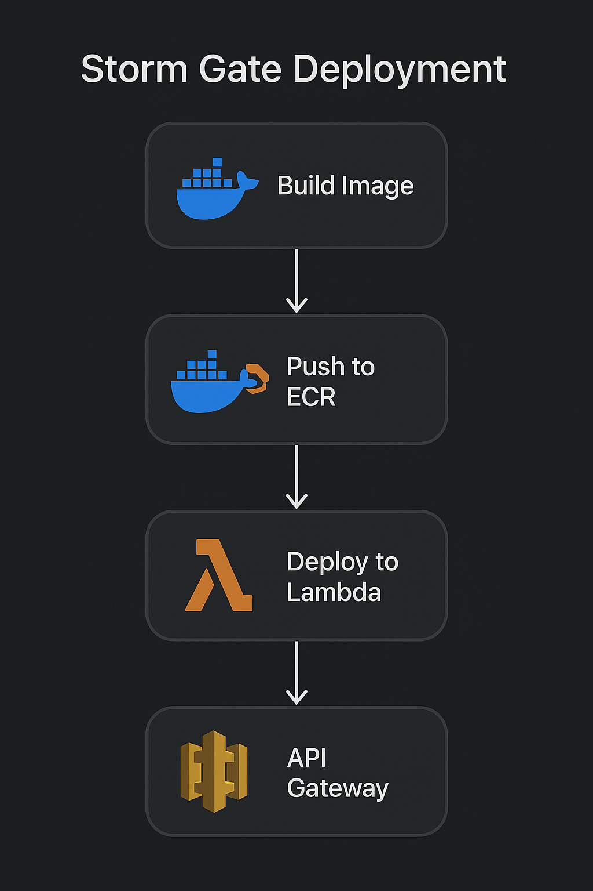

[![Contributors][contributors-shield]][contributors-url]
[![Forks][forks-shield]][forks-url]
[![Stargazers][stars-shield]][stars-url]
[![Issues][issues-shield]][issues-url]
[![MIT License][license-shield]][license-url]
[![LinkedIn][linkedin-shield]][linkedin-url]

<div align="center">
  <a href="https://github.com/your_username/repo_name">
    
  

  </a>
  <br />
  <p align="center">
    Fortifying Authentication, Unleashing Confidence.
    <br />
    <a href="https://github.com/your_username/repo_name"><strong>Explore the docs »</strong></a>
    <br />
    <br />
    <a href="https://github.com/your_username/repo_name">View Demo</a>
    ·
    <a href="https://github.com/your_username/repo_name/issues">Report Bug</a>
    ·
    <a href="https://github.com/your_username/repo_name/issues">Request Feature</a>
  </p>
</div>

<!-- TABLE OF CONTENTS -->
<details>
  <summary>Table of Contents</summary>
  <ol>
    <li><a href="#about-the-project">About The Project</a></li>
    <li><a href="#built-with">Built With</a></li>
    <li><a href="#getting-started">Getting Started</a></li>
    <li><a href="#deployment">Deployment</a></li>
    <li><a href="#usage">Usage</a></li>
    <li><a href="#release-history">Release History</a></li>
    <li><a href="#roadmap">Roadmap</a></li>
    <li><a href="#contributing">Contributing</a></li>
    <li><a href="#license">License</a></li>
    <li><a href="#contact">Contact</a></li>
  </ol>
</details>

<!-- ABOUT THE PROJECT -->
## About The Project

<!--  -->




Storm Gate is an advanced authentication API service meticulously crafted with Node.js, offering unparalleled security and reliability for user authentication processes. Now deployed on AWS Lambda with MongoDB Atlas, it leverages modern serverless infrastructure to ensure seamless performance, auto-scaling, and global availability. Featuring Azure AD integration for enterprise-grade authentication, the service provides developers with a powerful, production-ready tool to authenticate users with ease and confidence, safeguarding their applications from unauthorized access.

- ⚡ **Serverless auto-scaling**
- 🛡️ **Azure AD secure authentication**
- 🗂️ **Cloudinary media handling**
- 🔐 **JWT access + refresh token rotation**
- 🔄 **Continuous deployment pipeline using AWS ECR + Lambda**
- ☁️ **Global availability through API Gateway**

**🌐 Live Application**: Deployed on AWS Lambda (Serverless)

<p align="right">(<a href="#top">back to top</a>)</p>

### Built With

List the technologies, frameworks, and libraries that you used in your project.

- [NodeJS](https://nodejs.org/en)
- [ExpressJS](https://expressjs.com/)
- [MongoDB Atlas](https://www.mongodb.com/cloud/atlas)
- [Azure AD](https://azure.microsoft.com/en-us/services/active-directory/)
- [AWS Lambda](https://aws.amazon.com/lambda/) - Serverless deployment platform
- [AWS API Gateway](https://aws.amazon.com/api-gateway/)
- [AWS ECR](https://aws.amazon.com/ecr/)
- [Cloudinary](https://cloudinary.com/) - Image and video management
- [JWT](https://jwt.io/) - JSON Web Tokens for authentication
  
_Deprecated technologies:_
- ~~[Nginx](https://www.nginx.com/)~~ 
- ~~[AWS EC2](https://aws.amazon.com/ec2/)~~

<p align="right">(<a href="#top">back to top</a>)</p>

<!-- GETTING STARTED -->
## Getting Started

Provide instructions on how to set up and run your project locally. Include prerequisites, installation steps, and any other necessary information.

### Prerequisites

  Ensure you have installed:

- Node.js 18+
- Docker Desktop
- AWS CLI (configured)
- MongoDB Atlas connection string

```sh
npm install npm@latest -g
```

### Installation

1. Clone the repository:

```sh
git clone https://github.com/HoseaCodes/Storm-Gate
```

2. Navigate to the project directory:

```sh
cd Storm-Gate
```

3. Install dependencies:

```sh
npm install
```

4. Configure and set up any environment variables or settings if needed.

<p align="right">(<a href="#top">back to top</a>)</p>

<!-- DEPLOYMENT -->
## Deployment

Storm Gate is successfully deployed and running on **AWS Lambda** (Serverless) using a Docker image.

### Deployment Information

- **🌐 Platform**: AWS Lambda (Serverless)
- **🏥 Health Check**: Available via Lambda function invocation
- **📚 API Documentation**: Available via Lambda function endpoints
- **🚀 Deployment**: One-command deployment with `./deploy-lambda-complete.sh`

### Quick Deployment Commands

```bash
# Clean up any existing resources and deploy fresh
./cleanup-lambda.sh --force
./deploy-lambda-complete.sh
```

### Lambda Only Updates

```bash
# Update Lambda function only, keep existing API Gateway
./deploy-lambda-complete.sh --skip-api-gateway
```

### Common Deployment Issues & Solutions

During deployment, we encountered and resolved several critical issues:

#### 1. MongoDB Connection Error
**Problem**: The app was trying to connect to `::1:27017` (localhost) instead of MongoDB Atlas.

**Solution**: Properly configured the `MONGODB_URL` environment variable to point to the MongoDB Atlas cluster.

#### 2. Network Binding Issue
**Problem**: The server was not listening on the correct interface for containerized environments.

**Solution**: Fixed the server to bind to `0.0.0.0:8080` instead of just `localhost`:

```javascript
// Fixed server binding in src/server.js
app.listen(port, '0.0.0.0', function () {
  console.log(`Express app running on port: ${port}`);
});
```

#### 3. Docker Build Dependencies
**Problem**: Native modules like `jpegtran-bin` required build tools for compilation.

**Solution**: Updated Dockerfile to include necessary build dependencies:

```dockerfile
# Install build dependencies for native modules
RUN apk add --no-cache \
    gcc \
    g++ \
    make \
    python3 \
    autoconf \
    automake \
    libtool \
    nasm \
    libpng-dev \
    libjpeg-turbo-dev
```

### Environment Variables

The following environment variables are properly configured in production:

- `MONGODB_URL` - MongoDB Atlas connection string
- `ACCESS_TOKEN_SECRET` & `REFRESH_TOKEN_SECRET` - JWT token secrets
- `TENANT_ID`, `CLIENT_ID`, `CLIENT_SECRET` - Azure AD configuration
- `EMAIL_USER`, `EMAIL_PASS`, `ADMIN_EMAIL` - Email service configuration
- `CLOUND_NAME`, `CLOUD_API_KEY`, `CLOUD_API_SECRET` - Cloudinary configuration
- `BASE_URL`, `REDIRECT_URI` - Application URLs
- `NODE_ENV` - Set to `production`

### Deployment Features

✅ **Auto-scaling**: AWS Lambda automatically scales from 0 to thousands of requests  
✅ **Health Monitoring**: CloudWatch monitoring and logging built-in  
✅ **Environment Security**: All sensitive data properly configured as Lambda environment variables  
✅ **Production Ready**: Optimized Docker container with Lambda runtime  
✅ **Azure AD Integration**: Full OAuth authentication flow configured for production  

### Post-Deployment Requirements

**Important**: After deployment, make sure to update your Azure AD app registration:

1. Go to your Azure AD app registration
2. Navigate to "Authentication" settings
3. Add your Lambda function URL or API Gateway URL for the redirect URI
4. Save the configuration

### Monitoring & Maintenance

Monitor your application using AWS CLI and CloudWatch:

```bash
# Check Lambda function status
aws lambda get-function --function-name storm-gate --region us-east-1

# View real-time logs
aws logs tail /aws/lambda/storm-gate --follow --region us-east-1

# Test Lambda function
aws lambda invoke --function-name storm-gate --payload '{"httpMethod":"GET","path":"/health"}' response.json

# Deploy updates
./deploy-lambda-complete.sh
```

### Deployment Architecture

- **Platform**: AWS Lambda (Serverless computing platform)
- **Runtime**: Node.js 18 (Lambda container runtime)
- **Database**: MongoDB Atlas (Cloud database)
- **Authentication**: Azure AD (Enterprise identity platform)
- **File Storage**: Cloudinary (Image and video management)
- **Email Service**: Gmail SMTP (Transactional emails)
- **Container Registry**: AWS ECR (Elastic Container Registry)

<p align="right">(<a href="#top">back to top</a>)</p>

<!-- USAGE -->
## Usage

Provide examples, use cases, or detailed instructions on how to use your project. Include code snippets or screenshots if applicable.

For more examples, please refer to the [Documentation](https://example.com).

<p align="right">(<a href="#top">back to top</a>)</p>

<!-- RELEASE -->
## Release History

See [Change Log](CHANGELOG.md)

<p align="right">(<a href="#top">back to top</a>)</p>

<!-- ROADMAP -->
## Roadmap

Outline the future plans and enhancements you have for the project. You can list completed tasks and upcoming features.

- [x] ~~Deploy on EC2~~ (Legacy deployment)
- [x] **Deploy on AWS Lambda** (Current serverless deployment)
- [x] **MongoDB Atlas Integration** (Cloud database)
- [x] **Azure AD Authentication** (Enterprise identity)
- [x] **Cloudinary Integration** (Image management)
- [x] **Auto-scaling Infrastructure** (AWS Lambda serverless)
- [x] **Production Environment Variables** (Secure secrets management)
- [x] **Health Monitoring & API Documentation** (Operational readiness)
<!-- - [ ] Feature 3 -->
<!-- - [ ] Feature 4
  - [ ] Sub Feature 1
  - [ ] Sub Feature 2 -->

See the [open issues](https://github.com/your_username/Storm-Gate/issues) for a full list of proposed features and known issues.

<p align="right">(<a href="#top">back to top</a>)</p>

<!-- CONTRIBUTING -->
## Contributing

Explain how others can contribute to your project. Include guidelines for pull requests and contributions.

1. Fork the Project
2. Create your Feature Branch (`git checkout -b feature/AmazingFeature`)
3. Commit your Changes (`git commit -m 'Add some AmazingFeature'`)
4. Push to the Branch (`git push origin feature/AmazingFeature`)
5. Open a Pull Request

See Contribution file

<p align="right">(<a href="#top">back to top</a>)</p>

<!-- LICENSE -->
## License

Distributed under the [MIT License](LICENSE). See `LICENSE` for more information.

<p align="right">(<a href="#top">back to top</a>)</p>

<!-- CONTACT -->
## Contact

- Name - [@DominiqueRHosea](https://twitter.com/DominiqueRHosea)
- Email - info@ambitiousconcept.com
- Project Link: [https://github.com/HoseaCodes/Storm-Gate](https://github.com/HoseaCodes/Storm-Gate)

<p align="right">(<a href="#top">back to top</a>)</p>

<!-- ACKNOWLEDGMENTS -->
## Acknowledgments

List any resources, libraries, or tools that you used or were inspired by during the development of your project.

* [Node-Cache](https://www.npmjs.com/package/node-cache)
* [Imagemin](https://www.npmjs.com/package/imagemin)
* [Bcrypt](https://www.npmjs.com/package/bcrypt)
* [Jsonwebtoken](https://jwt.io/)
* [PM2](https://pm2.keymetrics.io/)
* [Mongoose](https://mongoosejs.com/)

<p align="right">(<a href="#top">back to top</a>)</p>


Feel free to customize the content and replace placeholders with your project-specific information.


<!-- MARKDOWN LINKS & IMAGES -->
<!-- https://www.markdownguide.org/basic-syntax/#reference-style-links -->
[contributors-shield]: https://img.shields.io/github/contributors/othneildrew/Best-README-Template.svg?style=for-the-badge
[contributors-url]: https://github.com/othneildrew/Best-README-Template/graphs/contributors
[forks-shield]: https://img.shields.io/github/forks/othneildrew/Best-README-Template.svg?style=for-the-badge
[forks-url]: https://github.com/othneildrew/Best-README-Template/network/members
[stars-shield]: https://img.shields.io/github/stars/othneildrew/Best-README-Template.svg?style=for-the-badge
[stars-url]: https://github.com/othneildrew/Best-README-Template/stargazers
[issues-shield]: https://img.shields.io/github/issues/othneildrew/Best-README-Template.svg?style=for-the-badge
[issues-url]: https://github.com/othneildrew/Best-README-Template/issues
[license-shield]: https://img.shields.io/github/license/othneildrew/Best-README-Template.svg?style=for-the-badge
[license-url]: https://github.com/othneildrew/Best-README-Template/blob/master/LICENSE.txt
[linkedin-shield]: https://img.shields.io/badge/-LinkedIn-black.svg?style=for-the-badge&logo=linkedin&colorB=555
[linkedin-url]: https://linkedin.com/in/othneildrew
[product-screenshot]: images/screenshot.png
